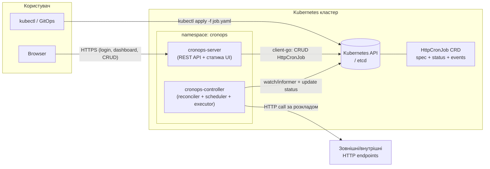
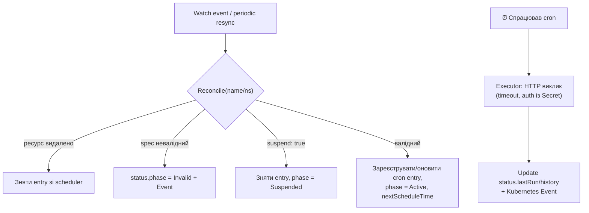

# CronOps

**Kubernetes-native cronjob manager для HTTP-викликів.** GitOps-first підхід за зразком ArgoCD: усі об'єкти системи — це CRD, а Kubernetes API (etcd) виступає одночасно джерелом правди та базою даних. Жодної зовнішньої БД.

> Статус: ✅ MVP (v0.1) реалізовано — контролер, REST API, Web UI, Helm chart. Див. [чекліст MVP](#mvp--обсяг-робіт) та [Roadmap](#roadmap).

---

## Зміст

- [Концепція](#концепція)
- [Технологічний стек](#технологічний-стек)
- [Архітектура](#архітектура)
  - [Компоненти](#компоненти)
  - [Схема взаємодії](#схема-взаємодії)
  - [CRD: HttpCronJob](#crd-httpcronjob)
  - [Controller та reconciliation loop](#controller-та-reconciliation-loop)
  - [API Server](#api-server)
  - [Web UI](#web-ui)
  - [Авторизація](#авторизація)
  - [Зберігання даних](#зберігання-даних)
- [REST API (MVP)](#rest-api-mvp)
- [Розгортання](#розгортання)
- [Структура репозиторію](#структура-репозиторію)
- [MVP — обсяг робіт](#mvp--обсяг-робіт)
- [Roadmap](#roadmap)
- [Локальна розробка](#локальна-розробка)
- [Безпека](#безпека)
- [Ліцензія](#ліцензія)

---

## Концепція

CronOps вирішує задачу планування та виконання періодичних **HTTP-викликів** (webhooks, тригери пайплайнів, health-пінги, виклики внутрішніх API) декларативним способом:

1. Користувач описує cron-задачу як Kubernetes-ресурс (`HttpCronJob`) — через `kubectl apply`, через Web UI або (у майбутньому) через GitOps-інструмент (ArgoCD/Flux), оскільки ресурс — це звичайний YAML-маніфест.
2. Контролер CronOps спостерігає за ресурсами через watch/informer-механізм, будує внутрішній розклад і виконує HTTP-виклики у визначений час.
3. Результати запусків записуються назад у `status` ресурсу та в Kubernetes Events — стан системи завжди можна відновити з кластера.

Ключові принципи (запозичені в ArgoCD):

| Принцип | Реалізація в CronOps |
|---|---|
| Kubernetes-native | Усі сутності — CRD; деплой — у кластер |
| K8s як джерело правди і БД | Стан зберігається лише в etcd через K8s API |
| Декларативність | `spec` описує бажаний стан, `status` — фактичний |
| Reconciliation | Контролер постійно зводить фактичний стан до бажаного |
| GitOps-ready | Маніфести можна тримати в Git і деплоїти будь-яким GitOps-інструментом; власний GitOps-механізм **не** реалізуємо в MVP |

---

## Технологічний стек

| Шар | Технологія | Обґрунтування |
|---|---|---|
| Backend | **Go 1.24+**, [controller-runtime](https://github.com/kubernetes-sigs/controller-runtime) / kubebuilder | Стандарт де-факто для K8s-операторів: informers, кеші, leader election, генерація CRD «з коробки». ArgoCD написаний саме так |
| Cron-движок | [robfig/cron/v3](https://github.com/robfig/cron) | Перевірена бібліотека, підтримка таймзон і стандартного cron-синтаксису |
| API Server | Go, `net/http` + [chi](https://github.com/go-chi/chi) router | Легкий REST без зайвих залежностей |
| Frontend | **React 18 + TypeScript + Vite**, чистий CSS | Вимога; Vite — швидкий dev/build; без CSS-фреймворку в MVP |
| YAML-редактор в UI | Простий редактор у MVP; Monaco Editor — Roadmap (v0.4) | Monaco вимагає локального бандлінгу воркерів — свідомо відкладено |
| База даних | **немає** — Kubernetes API / etcd | CRD `spec` + `status` + Events |
| Деплой | Kubernetes ≥ 1.27, Helm chart + сирі маніфести | |
| CI | GitHub Actions | lint, test, build, публікація образів |

---

## Архітектура

### Компоненти

Слідуємо моделі ArgoCD (`argocd-application-controller` + `argocd-server`): **два мікросервіси** з чітко розділеними відповідальностями.

#### 1. `cronops-controller` (backend-контролер)

- Watch/informer на ресурси `HttpCronJob` у дозволених namespace'ах.
- **Reconciliation loop**: на кожну подію (create/update/delete) та періодичний resync перебудовує запис у внутрішньому планувальнику.
- **Scheduler**: in-memory реєстр cron-розкладів (`map[namespacedName]cron.EntryID`), повністю відновлюваний з etcd після рестарту — нічого не втрачається.
- **Executor**: виконує HTTP-виклик (метод, endpoint, headers, auth, body) з таймаутом; пише результат у `status` ресурсу і генерує Kubernetes Event.
- Leader election — для безпечної роботи в кілька реплік (виконує запуски лише лідер).
- Не має публічного API; назовні віддає лише `/healthz`, `/readyz` та `/metrics` (Prometheus).

#### 2. `cronops-server` (API + Web UI)

- Віддає статику React-застосунку.
- REST API (`/api/v1/...`) — фасад над Kubernetes API: CRUD для `HttpCronJob`, агрегована статистика для dashboard.
- Сесійна авторизація користувачів UI (JWT cookie).
- Спілкується з кластером через свій ServiceAccount (client-go), тобто UI-користувачам не потрібні особисті kubeconfig.

> Чому не один бінарник: контролер і API мають різні цикли життя, профілі навантаження та RBAC-права (контролеру потрібен write у `status`, серверу — CRUD у `spec`). Розділення також відповідає вимозі «два мікросервіси» і моделі ArgoCD.

### Схема взаємодії



Потік даних при створенні задачі через UI:

```
Browser → POST /api/v1/cronjobs → cronops-server → K8s API (create HttpCronJob)
   → watch event → cronops-controller → реєстрація в scheduler
   → (час X) → executor → HTTP виклик → update status + Event
   → Browser ← GET /api/v1/cronjobs ← cronops-server ← K8s API (read status)
```

### CRD: HttpCronJob

`apiVersion: cronops.io/v1alpha1`, `kind: HttpCronJob`, namespaced, скорочення `hcj`.

```yaml
apiVersion: cronops.io/v1alpha1
kind: HttpCronJob
metadata:
  name: nightly-report
  namespace: team-a
spec:
  # --- обов'язкові ---
  schedule: "0 3 * * *"          # стандартний cron-вираз
  endpoint: "https://api.example.com/v1/reports/run"
  method: POST                    # GET|POST|PUT|PATCH|DELETE|HEAD

  # --- необов'язкові ---
  timezone: "Europe/Kyiv"         # default: UTC
  suspend: false                  # пауза без видалення (аналог CronJob.spec.suspend)
  headers:
    - name: Content-Type
      value: application/json
    - name: X-Request-Source
      value: cronops
  auth:
    type: bearer                  # none|basic|bearer|apiKey
    secretRef:                    # креденшели НЕ в spec, а в K8s Secret
      name: report-api-token
      key: token
    # для apiKey додатково: headerName: X-API-Key
  body: |
    {"period": "daily", "format": "pdf"}
  timeoutSeconds: 30              # default: 30
  successHttpCodes: ["2xx"]       # критерій успіху, default: 2xx
  retry:
    attempts: 0                   # default: 0 (без ретраїв у MVP)
    backoffSeconds: 10
  concurrencyPolicy: Forbid       # Allow|Forbid (default: Forbid)
  historyLimit: 10                # скільки останніх запусків тримати в status
  captureResponseBody: true       # зберігати фрагмент відповіді (2 КіБ) в історії;
                                  # вимкніть для чутливих відповідей (default: true)

status:                           # заповнює контролер (status subresource)
  phase: Active                   # Active|Suspended|Invalid
  observedGeneration: 4
  lastScheduleTime: "2026-06-10T03:00:00Z"
  nextScheduleTime: "2026-06-11T03:00:00Z"
  lastRun:
    startedAt: "2026-06-10T03:00:00Z"
    finishedAt: "2026-06-10T03:00:02Z"
    result: Success               # Success|Failed
    httpStatusCode: 200
    durationMs: 1840
    responseBody: '{"report":"queued"}'   # обрізаний до 2 КіБ фрагмент
    message: ""
  history:                        # кільцевий буфер останніх historyLimit запусків
    - startedAt: "..."
      result: Failed
      httpStatusCode: 503
      message: "service unavailable"
  conditions:
    - type: Scheduled
      status: "True"
      reason: ValidSchedule
```

Дизайн-рішення:

- **Секрети не в spec.** Паролі/токени посилаються через `secretRef` на стандартний K8s Secret — маніфест безпечно тримати в Git (GitOps-ready).
- **`status` subresource** — контролер пише тільки в status, користувачі/server — тільки в spec; розділення прав на рівні RBAC.
- **Історія запусків у `status.history`** з лімітом — достатньо для dashboard-статистики MVP без окремої БД. Окремий CRD `HttpCronJobRun` для повної історії — у Roadmap.
- **OpenAPI-валідація** у CRD-схемі (enum для method/auth.type, pattern для schedule) + докладніша валідація в контролері з виставленням `phase: Invalid`.

### Controller та reconciliation loop



Властивості:

- **Ідемпотентність**: reconcile можна викликати скільки завгодно разів — результат однаковий.
- **Edge + level triggered**: реагуємо на події, але периодичний resync (informer cache) гарантує самовідновлення після збоїв.
- **Відновлення після рестарту**: scheduler — лише кеш; перезапуск контролера повністю відбудовує його з etcd (list + watch).
- **Один активний виконавець**: leader election через `coordination.k8s.io/Lease`.
- `concurrencyPolicy: Forbid` — якщо попередній запуск ще триває, новий пропускається з Event'ом.

### API Server

Тонкий шар над Kubernetes API без власного стану:

- Читання списків — з watch-кешу (informer) для швидкого dashboard.
- Запис — напряму в K8s API; конфлікти вирішуються optimistic concurrency (`resourceVersion`).
- Валідація вхідного YAML: dry-run проти K8s API (`kubectl apply --dry-run=server` еквівалент).
- Статистика dashboard агрегується на льоту зі `status` усіх ресурсів — окремого сховища метрик немає.

### Web UI

React SPA, сторінки MVP:

| Сторінка | Зміст |
|---|---|
| `/login` | Форма логіну (username/password) → JWT cookie |
| `/dashboard` | Лічильники: всього задач, активні/призупинені/невалідні; статистика останніх запусків (success/failed/suspended); список останніх подій |
| `/cronjobs` | Таблиця всіх задач: name, namespace, schedule, last run, next run, phase; дії: suspend/resume, delete |
| `/cronjobs/new` | Створення: **(а)** форма з полями (обов'язкові: name, schedule, endpoint, method; необов'язкові: headers, auth, body, timezone, …) з live-прев'ю згенерованого YAML, **(б)** вкладка «YAML» з Monaco-редактором для вставки готового маніфеста |
| `/cronjobs/:ns/:name` | Деталі задачі: spec, історія запусків, events, кнопки edit/suspend/run-now\* |

\* «run-now» — тригер позачергового запуску, кандидат на MVP+.

### Авторизація

Оскільки БД немає, користувачі UI в MVP — **статичні, з K8s Secret** (як `argocd-initial-admin-secret`):

1. Secret `cronops-users` містить bcrypt-хеші паролів.
2. `POST /api/v1/auth/login` перевіряє пароль → видає короткоживучий JWT (підпис ключем із Secret) у httpOnly cookie.
3. Middleware перевіряє JWT на всіх `/api/v1/*`, крім `/auth/login` та `/healthz`.

LDAP та SSO/OIDC (Dex, як в ArgoCD) — у Roadmap (v0.3). До зовнішніх endpoint'ів задачі автентифікуються окремо — через `spec.auth` + Secret.

### Зберігання даних

| Дані | Де зберігаються |
|---|---|
| Визначення задач | `HttpCronJob.spec` (etcd) |
| Стан/результати запусків | `HttpCronJob.status` (etcd) |
| Журнал подій | Kubernetes Events (TTL ~1 год за замовчуванням) |
| Креденшели задач | Kubernetes Secrets |
| Користувачі UI | Kubernetes Secret (bcrypt) |
| Розклад у пам'яті | In-memory кеш контролера, відновлюваний |

---

## REST API (MVP)

Базовий префікс: `/api/v1`.

| Метод | Шлях | Опис |
|---|---|---|
| POST | `/auth/login` | Логін, видає JWT cookie |
| POST | `/auth/logout` | Інвалідація cookie |
| GET | `/me` | Поточний користувач |
| GET | `/stats` | Агрегати для dashboard (total/active/suspended/invalid, last runs success/failed) |
| GET | `/cronjobs?namespace=` | Список задач |
| POST | `/cronjobs` | Створити (JSON-поля або `Content-Type: application/yaml` з маніфестом) |
| GET | `/cronjobs/{ns}/{name}` | Деталі (spec + status + history) |
| PUT | `/cronjobs/{ns}/{name}` | Оновити |
| PATCH | `/cronjobs/{ns}/{name}/suspend` | `{"suspend": true|false}` |
| DELETE | `/cronjobs/{ns}/{name}` | Видалити |
| GET | `/healthz`, `/readyz` | Проби |

---

## Розгортання

Усе ставиться в кластер одним Helm-чартом (`deploy/chart`) або сирими маніфестами (`deploy/manifests`):

```
namespace: cronops
├── CRD httpcronjobs.cronops.io
├── Deployment cronops-controller (1–2 репліки, leader election)
│   └── ServiceAccount + ClusterRole: get/list/watch hcj; update hcj/status; read secrets; create events; lease
├── Deployment cronops-server (N реплік, stateless)
│   └── ServiceAccount + ClusterRole: CRUD hcj; read hcj/status
├── Service + Ingress для cronops-server
└── Secrets: cronops-users, cronops-jwt-key
```

```bash
# 1. Згенерувати креденшели UI
htpasswd -bnBC 10 "" 'your-password' | tr -d ':\n' | sed 's/$2y/$2a/'  # bcrypt-хеш
openssl rand -base64 32                                                # JWT-ключ

# 2. Встановити chart (секрети створює chart або керуйте ними самостійно)
helm install cronops ./deploy/chart -n cronops --create-namespace \
  --set auth.createSecrets=true \
  --set auth.users.admin='<bcrypt-хеш>' \
  --set auth.jwtKey='<jwt-ключ>'

# Альтернатива — сирі маніфести:
kubectl apply -f deploy/crd/ -f deploy/manifests/   # секрети: див. 05-secrets.example.yaml

# 3. Створення задачі вручну, без UI
kubectl apply -f examples/nightly-report.yaml
kubectl get hcj -A
```

### Тестування на реальному кластері

CI публікує артефакти в GHCR:

| Артефакт | Адреса | Коли і з яким тегом |
|---|---|---|
| Образ контролера | `ghcr.io/alexpokatilov/cronops-controller` | PR → `build-<run_number>`; GitHub Release → `<tag>` + `latest` |
| Образ API+UI | `ghcr.io/alexpokatilov/cronops-server` | ті самі |
| Helm chart | `oci://ghcr.io/alexpokatilov/charts/cronops` | GitHub Release → версія з тега (без `v`), образи в values запінені на тег |

Тобто реліз робиться через **GitHub Release** (зокрема pre-release) на тег `vX.Y.Z`, а кожен PR-білд можна потягнути для тесту за тегом `build-<N>` (номер запуску workflow Build).

> ⚠️ Перша публікація створює пакети **приватними**. Зробіть їх публічними в GitHub → Packages → Package settings → Change visibility, або додайте `imagePullSecrets` у деплойменти.

```bash
# 1. Креденшели UI
HASH=$(htpasswd -bnBC 10 "" 'your-password' | tr -d ':\n' | sed 's/$2y/$2a/')
JWT=$(openssl rand -base64 32)

# 2. Встановлення з OCI-реєстру (CRD ставиться автоматично з crds/ чарта)
helm install cronops oci://ghcr.io/alexpokatilov/charts/cronops \
  -n cronops --create-namespace \
  --set auth.createSecrets=true \
  --set "auth.users.admin=$HASH" \
  --set auth.jwtKey="$JWT"

# 3. Перевірка, що все піднялось
kubectl -n cronops get pods                       # 2x controller (1 лідер), 2x server
kubectl -n cronops logs deploy/cronops-controller | head
kubectl get crd httpcronjobs.cronops.io

# 4. Доступ до UI без Ingress — port-forward
kubectl -n cronops port-forward svc/cronops-server 8090:80
# → http://localhost:8090 (логін admin / your-password)

# 5. Тестова задача та спостереження за запусками
kubectl apply -f examples/simple-ping.yaml
kubectl get hcj -A -w                             # phase, last result
kubectl describe hcj simple-ping                  # status.history + Events
kubectl -n cronops logs deploy/cronops-controller -f

# 6. Suspend/Resume та видалення з CLI
kubectl patch hcj simple-ping --type merge -p '{"spec":{"suspend":true}}'
kubectl delete hcj simple-ping
```

Для тесту останніх змін із `main` на «живому» кластері використовуйте тег `latest` із примусовим pull:

```bash
helm upgrade cronops oci://ghcr.io/alexpokatilov/charts/cronops -n cronops \
  --reuse-values \
  --set controller.image.pullPolicy=Always \
  --set server.image.pullPolicy=Always
kubectl -n cronops rollout restart deploy/cronops-controller deploy/cronops-server
```

Для тесту конкретного PR-білда пініть образ на тег збірки: `--set controller.image.tag=build-<N> --set server.image.tag=build-<N>`; для відтворюваних деплоїв — реліз-тег `vX.Y.Z`.

---

## Структура репозиторію

```
CronOps/
├── api/v1alpha1/            # Go-типи CRD (kubebuilder-маркери) + згенерований deepcopy
├── cmd/
│   ├── controller/          # main для cronops-controller
│   └── server/              # main для cronops-server
├── internal/
│   ├── controller/          # Reconciler + виконання запусків (runJob)
│   ├── scheduler/           # обгортка robfig/cron, реєстр entries
│   ├── executor/            # HTTP-виконавець (auth, timeout, критерії успіху)
│   ├── apiserver/           # REST handlers, middleware, статика SPA
│   └── auth/                # users secret, bcrypt, JWT cookie
├── web/                     # React + TS + Vite (frontend)
│   └── src/{pages,components,api.ts,types.ts}
├── deploy/
│   ├── crd/                 # згенерований CRD-маніфест (make generate)
│   ├── manifests/           # сирі K8s-маніфести (namespace, RBAC, deployments)
│   └── chart/               # Helm chart (crds/ + templates/)
├── examples/                # приклади HttpCronJob
├── hack/                    # скрипти dev-оточення (kind)
├── Dockerfile.controller    # distroless-образ контролера
├── Dockerfile.server        # distroless-образ API+UI
└── Makefile                 # build/test/generate/docker
```

---

## MVP — обсяг робіт

**Мета MVP:** робочий цикл «створив задачу (UI-форма / YAML / kubectl) → контролер виконав HTTP-виклик за розкладом → результат видно на dashboard».

### Backend-контролер
- [x] CRD `HttpCronJob` v1alpha1: schedule, endpoint, method, headers, auth (none/basic/bearer/apiKey через secretRef), body, timezone, suspend, timeoutSeconds, historyLimit, concurrencyPolicy
- [x] Go-типи з kubebuilder-маркерами, генерація CRD з OpenAPI-валідацією (controller-gen)
- [x] Reconciliation loop: watch + resync, реєстрація/оновлення/зняття cron entries
- [x] Scheduler на robfig/cron з підтримкою таймзон (`CRON_TZ`)
- [x] Executor: HTTP-виклик з таймаутом, підстановка креденшелів із Secret
- [x] Запис `status` (phase, lastRun, history, next/lastScheduleTime) + Kubernetes Events
- [x] Обробка suspend та невалідних spec (`phase: Invalid`)
- [x] Leader election, `/healthz` `/readyz` `/metrics`
- [x] Unit-тести reconciler/executor/scheduler (fake client + httptest)

### API Server
- [x] REST API за таблицею вище
- [x] Логін зі статичними користувачами (Secret + bcrypt) і JWT cookie
- [x] Створення з YAML із server-side dry-run валідацією (`?dryRun=true`)
- [x] Агрегація `/stats` зі status усіх ресурсів
- [x] Unit-тести handler'ів (login, CRUD, suspend, stats)

### Frontend
- [x] Сторінка логіну
- [x] Dashboard: total + розбивка active/suspended/invalid + останні запуски success/failed
- [x] Список задач з діями (suspend/resume/delete)
- [x] Створення: форма (обов'язкові/необов'язкові поля) з live-прев'ю YAML + YAML-режим з dry-run валідацією
- [x] Сторінка деталей задачі з історією запусків

### Інфраструктура
- [x] Dockerfile (multi-stage, distroless) для обох сервісів
- [x] Helm chart + сирі маніфести + RBAC (least privilege)
- [x] CI (GitHub Actions, окремі workflows): `lint` (golangci-lint, go test, tsc), `build` (PR-образи `build-<N>` у GHCR), `hadolint`, `codeql`, `release` (образи `<tag>`+`latest` і Helm-чарт у GHCR за GitHub Release)
- [x] `hack/kind-up.sh` для локального kind-кластера
- [x] Приклади в `examples/`

**Свідомо поза MVP:** власний GitOps-механізм (sync із Git), retry-політики, run-now, окремий Run-CRD, OIDC, нотифікації, multi-cluster.

---

## Roadmap

### v0.1 — MVP *(поточна ціль)*
Усе з розділу [MVP](#mvp--обсяг-робіт).

### v0.2 — Надійність запусків
- CRD `HttpCronJobRun` — окремий ресурс на кожен запуск: повна історія, TTL-очистка (замість обмеженого `status.history`)
- Retry-політика (attempts + backoff), `concurrencyPolicy: Replace`
- Кнопка/ендпоінт **run-now** (позачерговий запуск)
- Перевірка тіла відповіді (jsonpath/regex-критерії успіху, не лише HTTP-код)
- Prometheus-метрики запусків + готовий Grafana dashboard

### v0.3 — Користувачі та доступ
- LDAP-авторизація (Active Directory / OpenLDAP): bind-перевірка пароля, мапінг LDAP-груп на ролі
- OIDC/SSO (Dex), ролі read-only / editor / admin
- Project-модель як в ArgoCD: групування задач, обмеження namespace'ів і доменів endpoint'ів на проєкт
- Audit log дій користувачів (Events / структуровані логи)

### v0.4 — UX та інтеграції
- Live-оновлення UI (SSE/WebSocket замість polling)
- Нотифікації про падіння запусків (Slack/Telegram/email/webhook)
- Шаблони задач, дублювання, bulk-операції
- Валідація cron-виразу з людським описом («щодня о 03:00») у формі

### v0.5 — CLI
- CLI `cronops` (за зразком `argocd` CLI) — взаємодія без UI та інтерфейс для автоматизації/AI-агентів
- Команди: `login`, `list`, `get`, `create` (з прапорців або `-f manifest.yaml`), `edit`, `suspend`/`resume`, `delete`, `run-now`, `history`, `stats`
- Працює через той самий REST API `cronops-server` (єдина точка авторизації та аудиту)
- Автентифікація: логін/пароль або довгоживучий API-токен (для CI та агентів)
- Машиночитний вивід `-o json|yaml` поряд із табличним — для скриптів та AI-агентів
- Дистрибуція: один статичний бінарник (linux/macos/windows) + варіант kubectl-плагіна (`kubectl cronops`)

### v1.0 — GitOps та масштаб *(відкладено — до визначення необхідності)*
Ідеї зафіксовані як кандидати, рішення про реалізацію буде ухвалено пізніше; поки що GitOps-деплой маніфестів повністю покривається зовнішнім ArgoCD/Flux:
- Власний GitOps-режим: контролер синхронізує `HttpCronJob` з Git-репозиторію
- Drift detection і статус синхронізації (Synced/OutOfSync) у UI
- Multi-cluster: керування задачами в кількох кластерах з одного UI
- Не-HTTP виконавці: gRPC, запуск K8s Job
- Webhook-тригери (запуск задачі зовнішньою подією, не лише cron)

---

## Локальна розробка

```bash
# 1. Локальний кластер
hack/kind-up.sh                          # kind create cluster + install CRD

# 2. Контролер (поза кластером, з локальним kubeconfig)
go run ./cmd/controller --leader-elect=false

# 3. API server (порт 8090; --dev: логін admin/admin + CORS для vite)
go run ./cmd/server --dev

# 4. Frontend (vite dev server проксує /api на :8090)
cd web && npm install && npm run dev     # http://localhost:5173

# 5. Тестова задача
kubectl apply -f examples/simple-ping.yaml
kubectl get hcj -A

# Тести та регенерація CRD після зміни api/v1alpha1
make test
make generate
```

---

## Безпека

- Креденшели HTTP-викликів — лише в K8s Secrets, ніколи в `spec`/Git.
- RBAC за принципом мінімальних прав: controller не може змінювати `spec`, server не може писати `status`.
- JWT-ключ і паролі користувачів — у Secrets; паролі зберігаються як bcrypt-хеші.
- Таймаути та ліміт розміру відповіді в executor — захист від «зависання» на повільних endpoint'ах.
- Фрагмент тіла відповіді в історії запусків обрізається до 2 КіБ і вимикається через `spec.captureResponseBody: false`, якщо endpoint повертає чутливі дані.
- Roadmap: allowlist доменів endpoint'ів на рівні проєкту (захист від SSRF з UI), NetworkPolicy.

---

## Ліцензія

[Apache License 2.0](LICENSE)
